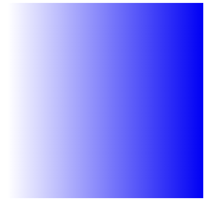
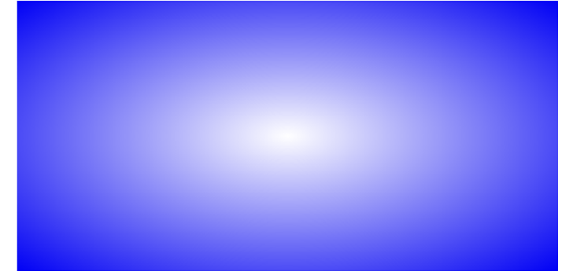

Css in depth 第四部分高级话题 第十一章笔记

<!--more-->

# 渐变

首先对background 这个属性有了解

        background-image  //指定一个文件或者生成颜色渐变作为背景图片
        background-position  //设置背景图片的初始位置
        background-size  //指定背景图片的渲染尺寸
        background-repeat  //决定在需要填充整个元素的时候是否平铺图片
        background-origin  //决定背景图片的相对区域(content-box，border-box，默认是padding-box)
        background-clip  //决定背景图片的绘制区域，值和上述一样
        background-attachment  //决定背景图片是否随着页面其余部分的滚动而滚动
        background-color  //指定背景颜色(渲染到背景图片下方)

## 线性渐变

然后我们就知道了渐变其实就是一种背景图片，用background-image 来定义，那如何定义一个渐变？ 这里就要引入 liner-gradient()这个函数了，
```css
.fade{
    height: 200px;
    width: 200px;
    background-image: liner-gradient (to right,white,blue);
}
```
效果如下


该函数有三个参数，第一个是角度，后面两个是起始颜色和终止颜色。
对于角度的设置可以为xdeg,比如0deg表示向上渐变，90deg表示向右渐变(顺时针旋转)，还有rad,turn,grad等单位，这里就不详细说了。
如果我们采用
`background-image: liner-gradient (to right,red 0%,white 50%,blue 100%);`
就可以实现多颜色渐变并确定它们渐变完成的位置。

如果在同一位置放多种颜色的话 
```css
.fade {
 height: 200px;
 width: 400px;
 background-image: linear-gradient(90deg,
 red 40%, white 40%,
 white 60%, blue 60%);
}
```
就会出现下图的条纹效果


线性渐变还有一种效果就是重复渐变，除了使用的函数repeating-linear-gradient()与线性渐变不同外，其接受参数参数和重复部分的效果都和线性渐变相同
```css
.fade {
 height: 1em;
 width: 400px;
 background-image: repeating-linear-gradient(-45deg,
 #57b, #57b 10px, #148 10px, #148 20px);
 border-radius: 0.3em;
}
```


## 径向渐变

和线性渐变的从一端沿直线到另一端不同，径向渐变是从一个点开始全方位向外扩展，如图


该渐变的函数是radial-gradient() ,通过类似于线性渐变函数的参数改变可以产生多种渐变效果，这里因为用的不多就不多说了。


# 阴影
分为两种，box-shadow / text-shadow。   
box-shadow的属性值为
`box-shadow: 1em(水平位移) 1em(垂直位移) 2px(模糊半径) 1px(扩展半径) black`
其中模糊半径设置阴影边缘模糊区域(更柔和)，扩展半径使阴影变大或变小

```css
.button {
 padding: 1em;
 border: 0;
 font-size: 0.8rem;
 color: white;
 border-radius: 0.5em;
 background-image: linear-gradient(to bottom, #57b, #148);
 box-shadow: 0.1em 0.1em 0.5em #124;
}
.button:active {
 box-shadow: inset 0 0 0.5em #124,
 inset 0 0.5em 1em rgba(0,0,0,0.4);
}
```
以上代码实现了如图效果
渐变阴影让元素更立体以及inset 让阴影在内部实现

# 混合模式 

***background-blend-mode*** 具体不介绍，知道有这么个东西就行，要用到就现查现用