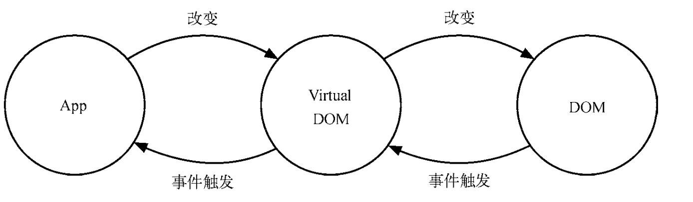
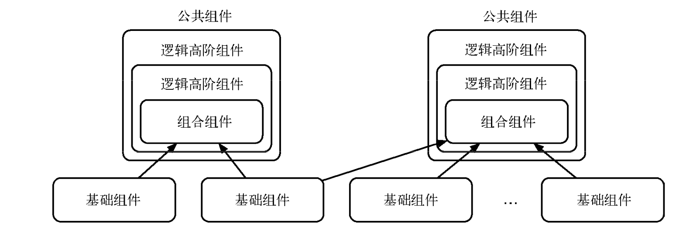

《深入react技术栈》读书笔记
<!--more-->

# 第一章 初入react世界

这章大致的介绍了react的一些基本概念 ，以及利用一个tab栏的例子引出了state，props，ref和生命周期函数的概念。要点如下：

## Virtual DOM
+ 就是react是操纵虚拟DOM的

+ 写react的编程方式是**函数式编程**，也就是声明式。
+ 虚拟DOM其实是以JSON对象的形式存在的，直接上代码

```js
// JSX
const buttonJSX = <button class="btn btn-blue"> 
                    <em>Confirm</em>
                  </button>
  
const buttonJSON = {
                    type: 'button',
                    props: {
                    className: 'btn btn-blue', 
                    children: [{
                      type: 'em',
                      props: {
                        children: 'Confirm' 
                        }
                      }] 
                    }
                  }
```
其他的部分没怎么细看了 似懂非懂


# 第二章 漫谈React

## 事件系统
即react中的事件都是封装好的合成事件。
1. 事件委派
在虚拟DOM被渲染后，react会把所有的事件处理函数绑定到结构的最外层，用一个统一的事件监听器管理，也就是说并不会直接绑定到单一的DOM节点上。这个事件监听器上维持了一个映射来保存所有组件内部的事件监听和处理函数。当组件挂载或卸载时，只是 在这个统一的事件监听器上插入或删除一些对象;当事件发生时，首先被这个统一的事件监听器 处理，然后在映射里找到真正的事件处理函数并调用。这样做简化了事件处理和回收机制，效率也有很大提升。
2. 自动绑定
在 React 组件中，每个方法的上下文都会指向该组件的实例，即自动绑定 this 为当前组件。 而且 React 还会对这种引用进行缓存，以达到CPU和内存的最优化。在使用 ES6 classes 或者纯函数时，这种自动绑定就不复存在了，我们需要手动实现 this 的绑定。


绑定this用bind方法或者使用箭头函数(在不传参的情况下可以用::的语法代替bind(),也就是说其实bind()方法在某种意义上已经被废弃了)。
然后现在有了hooks后函数组件的出现率应该会大于类组件了，而在函数组件中就没必要担心this的指向问题了。
然后我们也可以利用ref实现原生Js的事件，但没必要，都用上react不到  万不得已绝不轻易操纵真实DOM。

## 表单
无非就是受控组件和非受控组件的区别，这个没啥。

## 样式处理

用什么 css_moudles 复杂 看不懂 过

## 组件间通信
这个看之前的博客， 有总结过的

## 组件间抽象

1. mixin 第一次见这个东西 难懂 没理解 先过 **mixin 是一个包含可被其他类使用而无需继承的方法的类**这是维基百科的定义
2. 高阶组件 。。还好没深挖，react就采取高阶组件的方式代替了mixin，关于这个东西的概念C++这种面向对象的语言专业课应该会有讲

### 实现高阶组件
实现高阶组件的方法有两种吗，一种叫**属性代理(props proxy)**。高阶组件通过被包裹的 React 组件来操作 props，还有一种是**反向继承(inheritance inversion)**。高阶组件继承于被包裹的 React 组件

这个感觉东西有点多啊，专门写一篇博客吧。



## 组件性能优化
用purerender去解决不必要的渲染，好像hooks里useEffect可以用依赖解决这个问题

### pure Render
先说纯函数 老生常谈的问题了
 1. 给定相同的输入，它总是返回相同的输出; 
 2. 过程没有副作用(side effect)1;
 3. 没有额外的状态依赖。
再往下看好像真的很像useEffect的依赖

### Immutable
没看明白 不懂 用useEffect算了

### key
之前有写了篇博客关于key的机制

## 动画
就是可以用react的一些动画库写，就不用写繁琐的css了，好像有点东西，后面再深究
现有的动画
+ css
+ js-svg
+ react一些动画库 smooth啥的
+ React Transition 之前有了解过，收藏夹里吃灰好久了
+ react-motion
+ cubic-bezier （上面这两条都有关于缓动动画）

## 自动化测试
这.....还没上线过项目，测试啥的歇会儿吧

然后用了一堆库对第一章的tab优化了我？？？？？？？
人傻了  代码歇会儿放吧

后面就是看源码的部分了 难之