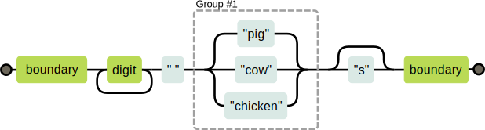

正则表达式就是用于定义某种规则，计算机可以通过该规则检测一个字符串是否符合该规则
或者将该字符串中符合正则表达式的内容提取出来
<!--more-->

# 语法

## 创建一个正则表达式
```js
//Regexp构造函数
let reg = new RegExp('正则表达式','匹配模式') //是一个对象 更简单

// 字面量
let reg = /a/i; //更灵活
```
每个正则表达式就是一个RegExp实例对象，有着自己的属性，包括source，lastIndex等，这些属性可以全面了解正则表达式等信息，但实际用得不多。

在正则表达式中，不属于特殊字符代码的(如\n)的反斜杠会被保留，不像在一般字符串中被忽略，并且问号和加号等特殊字符在正则表达式中具有特殊含义，若要表示该字符本身，前面也要加\说明，如/\+/。
匹配模式有i g m等，主要用: i忽略大小写 g开启全局匹配。

有一个test方法可以检测某字符串是否符合正则表达式,只要含有正则表达式中的的字符串就回返回true。
而exec()方法可以返回一个包含匹配信息的数组对象，该数组对象中有index(字符串中匹配模式的其实位置)和input(查找的字符串)两个属性，如果没有匹配到就返回一个null，如果不开启g，则每次调用该方法就回返回第一个匹配项，开启后则回往后搜寻下一个匹配项，并改变lastIndex属性的值(默认一直为0)。当正则表达式含有括号分组的字表达后，调用该方法后的数组对象第一个元素还是整体匹配的部分，但接下来的元素是由那些括号组所匹配的部分

## 字符集

｜表示或的意思 a|b  []里面也表示｜的关系  /[a-z]/表示任意的小写字母 /[A-z]/任意字母
/[^a]/表示不包含a 除了a。
字符集也有一些内置的快捷方式。

        \d  任何数字字符
        \w  字母数字字符
        \s  任何空白符字符
        \D  非数字字符
        \W  非字母数字字符
        \S  非空白符字符
        \b  匹配单词边界 (所谓单词就是隶属于\w下的字串)
        \B  匹配非单词边界
        .  除换行符以外的所有字符

对于要匹配重复的部分 则有以下方法，如：

        /+/ 匹配一个或多个字符
        /*/ 与加号类似，但允许匹配0次
        /?/ 令某一部分可选，即可能出现一次或者零次

        //若要表示精确次数，就用{}，如

        {2} 表示出现两次
        {2,4} 表示出现2-4次
        {2,} 表示出现两次即以上

**记得若要重复多个元素时，要用括号，例如 `/(abc)+/`**

        /^a/ 表示必须以a开头
        /a$/ 表示必须以a结尾

所以/^a$/表示所匹配的字符串中有且只有a


```js
console.log(`Lis, Bar
Mc, John
Wad, Phio`.replace(/(\w+), (\w+)/g, '$2 $1'));
// $1 和 $2 是模式中带括号的组。 整个匹配可以用 $&来表示。
// 上述代码是 $1 指向 Lis / Mc / Wad ，$2 指向 Bar / John / phio ,然后$2 指向的匹配代替了$1匹配原有的位置
```

字符串加正则
search 检索与正则表达式匹配的值 类似于indexof()方法 返回索引，搜不到就返回-1，接收正则表达式为参数
match   找到一个或多个正则的匹配  默认情况下之检索一个，开启全局匹配后则可以匹配多个， 把匹配到的内容封装成一个数组返回
replace 替换与正则表达式匹配的字串 两个参数，第一个是正则表达式，第二个是替换内容 
split   把字符串拆分成数组

## 匹配机制
```js
let animalCount = /\b\d+ (pig|cow|chicken)s?\b/
console.log(animalCount.tesr("15 pigs")) //true
```



回溯:
正则表达式/\b([01]+b|\d+|[\da-f]h)\b/可以匹配三种字符串：以b结尾的二进制数字，以h结尾的十六进制数字（即以 16 为进制，字母a到f表示数字 10 到 15），或者没有后缀字符的常规十进制数字。这是对应的图表。
