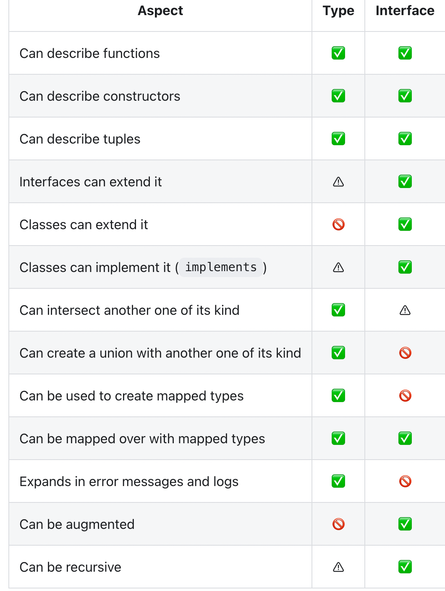

学了ts有段时间了 type跟interface的区别一直处于一个懵懂的状态，感觉很多地方他俩可以互相代替，和react联系起来后对于prop和state的定义上是用type或interface也有不明确的地方，所以写一篇博客谈谈理解和想法。
<!--more-->

# 简单定义

在说区别前我们先了解一下什么是 interface 和 type

## interface
**TypeScript的核心原则之一是对值所具有的结构进行类型检查。 它有时被称做“鸭式辨型法”或“结构性子类型化”。 在TypeScript里，接口的作用就是为这些类型命名和为你的代码或第三方代码定义契约。**

大致意思就是用来规范对象 ｜ 类 的，对象和类需要满足接口所定义的属性， 接口可以被extend(继承)和implementing(实现)

## type
type(类型别名)就是用来自定义类型的，什么联合类型交叉类型字面量类型等等，本质上说type其实是给你自定义类型重新取一个可读的名字
交叉类型(&)可以实现和extend差不多的效果

# 二者区别
翻了好多博客和官方文档 得到这样一句话
**“type aliases can act sort of like interfaces, however, there are some subtle differences.”**
和开头说的差不多，type在很多地方可以替代interface，但还是有一些差别。

## 是否创建新的变量名
官网中提到的第一处不同是“One difference is, that interfaces create a new name that is used everywhere. Type aliases don’t create a new name — for instance, error messages won’t use the alias name.”
这其实是不对的，在编译器中尝试会发现报错信息是一致的
比如
```ts
 interface PointInterface {
    x: number
    y: number
  }

  type PointType = {
    x: number
    y: number
  }

  const getSquareI = (args: PointInterface) => args.x * args.y
  const getSquareT = (args: PointType) => args.x * args.y

  // error: 类型{x: number}不能赋值给squareI/T 类型的参数，因为缺少了 {y: number}属性

```

## 关于extend 和 implemented
第二处不同
**“A second more important difference is that type aliases cannot be extended or implemented from”**
Mad！！！这也是错的！！！ 直接看代码
```ts
interface TreeDimeions extends PointType {
    z: number
  }

  class Rectangele implements PointType {
    x= 2
    y= 4
  }

  class RectangPrism implements TreeDimeions {
    x = 2
    y = 3
    z = 4

  }
  // 也可以通过type和interface实现对类的约束

  interface Shape {
    area(): number
  }
 
  type Perimeter = {
    perimeter(): number
  }

  class Rectangle implements PointType, Shape, Perimeter{

    x = 2
    y = 3

    area () {
      return this.x * this.y
    }

    perimeter() {
      return (this.x + this.y)*2
    }
  }
```

## type不能对其他type extend和implement
第三处不同说
**“type aliases cannot extend/implement other types”**
这句话也不对，但不说完全不对，只能说部分正确

``` ts
class Point {
  x: number
  y: number
}

interface Shape {
  area(): number
}
 
type Perimeter = {
  perimeter(): number
}

  // 通过 & 实现 extend
type RectangleShape = Shape & Perimeter & Point

class Rectangle implements RectangleShape Perimeter{

    x = 2
    y = 3

    area () {
      return this.x * this.y
    }

    perimeter() {
      return (this.x + this.y)*2
    }
  }

// 实现映射类型
type RectangleShape2 = Partial<Shape & Perimeter> & Point

class PartialRectangle implements RectangleShape2 {
  x = 2
  y = 3
}
```

# 二者区别 真
叭叭了这么多，所以二者的区别到底在哪儿呢

1. **you cannot use implements on an class with type alias if you use union operator within your type definition**
翻译就如果一个type是联合类型，那我就不能用类去实现他了


2. **you cannot use extends on an interface with type alias if you use union operator within your type definition**
差不多意思，一个type是联合类型，接口就不能继承了

这里那篇博客的解释是，类和接口都是一个 ***“blueprint” ***
所以他们不能实现和继承在 ***one or another shape*** 我英语太废物了完全不懂是什么意思啊赣了

3. **declaration merging doesn’t work with type alias**
type不能合并声明，这个很多博客都提到了，没啥多说的

因为type是一个unique type entity，无论是在全局变量还是module scope中

而在react中
always use interface for public API's definition when authoring a library or 3rd party ambient type definitions
consider using type for your React Component Props and State

对于props和state还是用type吧， 然后interface用于公共的API和第三方库的实现
就是这样 具体区别可能要看看定义interface和type的源码来了解了

[参考链接](https://medium.com/@martin_hotell/interface-vs-type-alias-in-typescript-2-7-2a8f1777af4c)




！在看深入react技术栈的时候看到一点:
**包括 C++ 等一些年龄较大的 OOP 语言， 它们都有一个强大但危险的多重继承特性。现代语言为了权衡利弊，大都舍弃了多重继承，只采用单继承，但单继承在实现抽象时有诸多不便之处。为了弥补缺失，Java 引入了接口(interface)， 其他一些语言则引入了像 mixin 的技巧，方法虽然不同，但都是为创造一种类似多重继承的效果， 事实上说它是组合更为贴切。**
结合Java来看，interface其实是更像抽象类的，所以用interface去规范类或许是更好的选择