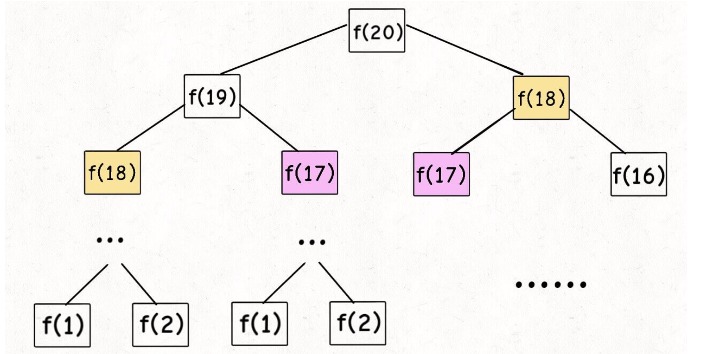
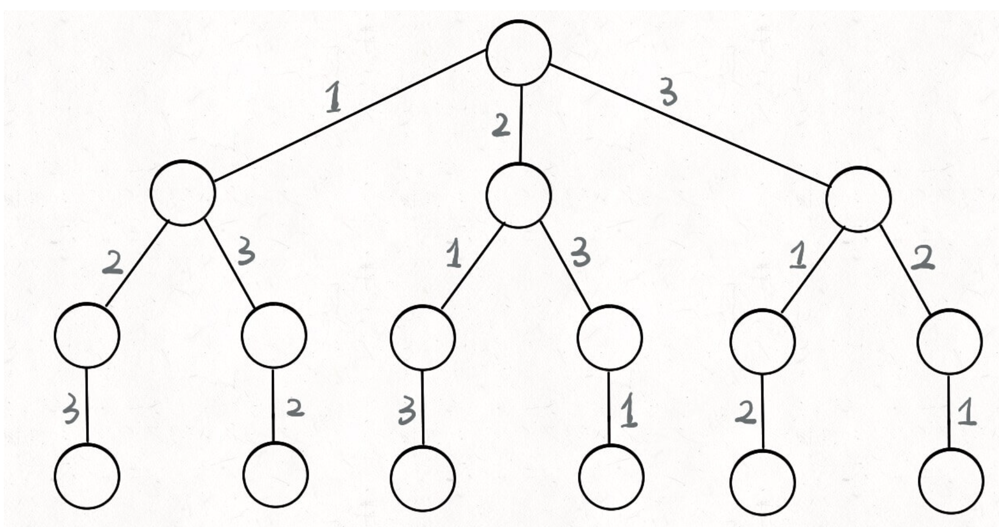

数据结构上刷算法... 好说歹说算是入门了
<!--more-->

# 何为动态规划
怎么说呢，动态规划就是是一种分治的思想，换句话说，就是把一个大问题，拆分成小问题，再把小问题接着拆分，拆到无可再分的时候，会得到最小的子问题，而子问题的答案很轻松就能得到，根据这个答案递推回去，就能得到原本问题的答案，是一种自底而上的做法。（当然也有自顶而下的方法）。动态规划核心套路是“穷举求最优解”，然后利用状态转移方程进行**正确的穷举**，也就是取消重叠子问题。
即，动态规划分治穷举后，两个重要特性就是 **重叠子问题**和**最优子结构**

## 状态转移方程
刚刚提到一个核心的概念，就是状态转移方程，这是做动态规划类问题最重要的一个步骤，也是最抽象的一个步骤，我们能想到状态转移方程就代表这道题我们理解了大半了，我们由斐波那契数列入手来引出这个概念。

```js
function fib (i){
  if (N == 1 || N == 2) return 1;
  return fib(N - 1) + fib(N - 2);
}
```
很简单吧，直接暴力递归，但是贼低效，鲁迅说过“所有递归问题都可以看作是树问题”，那我们就看看这个递归调用时的树，假设i = 20;

看看时间复杂度？O(2^n)，直接裂开来，而且你会发现有大量的重复计算，比如f(18)和f(17)都被计算了两次，更往下的子节点被重复计算的次数更多，这就是之前提到的**重叠子问题**，所以为了解决这个问题，我们引入一个备忘录。
```js
function fib (n){
  let dp = new Array(n + 1).fill(0)
  dp[1] = dp [2] = 1
  for(let i = 3; i <= n - 1; i++)
    dp[i] = dp[i - 1] +  dp[i - 2]
  return dp[n]
}
```
这我们可以得知，我们知道这是第n代的兔子，让我们去求第n代兔子的总数，也就是dp(n),并且dp(n) = dp(n-1) + dp(n-2)，哎，那求dp(n)的问题是不是就转移到求dp(n-1) + dp(n-2)了，这个就叫状态转移方程，当然不要忘了n = 1 和n = 2的情况。综上，我们得到斐波那契数列的状态转移方程

dp(n) = { 1,  n = 1,2
{dp(n-1) + dp(n-2), n > 2

这里解决了**重叠子问题**，那动态规划另一个重要特性**最优子结构**呢？
因为斐波那契不算真正的动态规划问题，写这个主要是为了引入如何抽象出状态转移方程，对于最优子结构，让我们往下看。

## 典中典的凑硬币
说起动态规划就不得不提凑硬币的问题，太经典了属于是。再说凑硬币问题前我们简单聊一聊贪心算法，贪心算法其实是动态规划的一个特例，动态规划是一只分分分分分到最后找出最优解，而贪心是先分解若干个子问题，找出最优，再从这个最优子问题中接着分解，也就是说**贪心算法是每一都要求出最优解的动态规划问题**。
这里说回来凑硬币问题，比如我们有面值为1，5，11元的硬币，要求凑出15元所用的最少硬币数。用贪心的话就是，第一步的最优解肯定是面值最大的11元，然后还差四元就需要用四枚一元硬币，一共五枚。而这道题真正的最优解其实是三枚五元硬币，这样就能看出贪心和动态规划的区别了。
那么这道题我们该如何思考呢？又或者是说怎么列出状态转移方程？仔细思考一下，我们之前有提到过动态分解到最小子问题后往上递归，也就是“自低而上”的思维，那这个问题的最底部显然就是0个硬币凑0元，再往上也就是一个硬币， 也就是凑了1，5，11元还剩14，10，4元，分别需要 dp[14]+1,dp[10]+1,dp[4]+1个，（这里dp[n]是凑n元需要的硬币数，这里因为要求最少硬币数，所以需要在dp[14],dp[10],dp[1]中找出最优的情况，所以底层往上的第一步，就是
dp[15] = min(dp[15-1],dp[15-5],dp[15-10])+1,这里15由未知数代替，考虑边界情况，也就是n<=0的情况，那我们不就能得到状态转移方程了？
dp[n] = { 0 ,n<=0 
{min(dp[15 - coin]), n>0
得到状态转移方程，再用自底而上的思维，得出代码
```js
const changeCoin = (coins,amount) => {
  // 初始化备忘录,用Infinity填满备忘录，Infinity说明该值不可以用硬币凑出来
  let dp = newArray(amount + 1).fill(Infinity)
  dp[0] = [0]
  for(let i = 1; i <= amount; i++){
    for(const coin of coins){
            if(coin <= i)
        dp[i] = Math.min(dp[i], dp[i - coin] + 1)
    }
  }
  return dp[amount] === Infinity ? -1 : dp[amount]
}
```
这样就结束啦！
那么最后，怎样判断一个问题是不是动态规划问题呢？
一般有
+ 求最大值，最小值
+ 判断方案是否可行
+ 统计方案个数
+ 子问题是否满足最优子结构，即每个子问题都不影响其他子问题

# 回溯算法
看完动态规划，我们就简单说一下回溯，回溯重点就是这个“回”字，他从本质上来说就是遍历决策树的过程，我们需要抓住这三点：
+ 路径 也就是做过的选择
+ 选择列表 当前可以选择的部分
+ 结束条件 到达决策树底部，没有新的选择

回溯是有框架的
```js
result = []
def backtrack(路径, 选择列表): if 满足结束条件:
result.add(路径) return
for 选择 in 选择列表: 做选择
backtrack(路径, 选择列表) 撤销选择
```
可以看到 这串代码的核心是，递归调用 backtrack，并且在递归之前做选择，递归之后撤销选择就行。

## 全排列
最基本的回溯问题就是全排列问题了，就比如给我们【1，2，3】三个数字，求出他们不重复情况的全排列，可以得到以下决策树

我们站在决策树的顶端，此时我们的选择列表是【1，2，3】，没有路径，因为我们还没做过选择，假设我们选择2后到达第二个节点，那么我们的选择列表是【1，3】，2就变成了我们的路径，然后 backtrack函数，就像是个指针，在这个树上游走，要维护每个节点的选择列表和路径，当它走到树的底层后，就触发了结束条件。
再然后，如何遍历一个树？ 要记住，所有搜索问题其实都是树的遍历问题，而多叉树的遍历，有两个重要框架，前序遍历和后序遍历，前序遍历在递归进入下一个节点前进行，后续遍历在进入一个节点后执行，前序遍历让多叉树得以向某一子节点递归，后序遍历可以让多叉树依次对多个子节点递归遍历，依照这个思路以及前面的框架，我们得出全排列代码
```js
const allSort = (nums) => {
  let res = []
  backTrack = (path) => { 
    // 判断是否满足结束条件
    if(nums.length === path.length){
      res.push([...path])  
      return
    } 

    // 解决重复路径
    for(let i = 0; i < nums.length; i++){
      if(path.indexOf(nums[i]) !== -1){
        continue
      }
      /** 前序遍历 */
      path.push(nums[i])

      backTrack(path)

      // 后序遍历
      path.pop()

    }
  }
  backTrack([])
  return res
}
```

## N皇后问题
这个也是回溯经典啊，单比全排列稍微复杂一丢丢，题目的意思就是给我们一个N x N的棋盘，在上面摆N个皇后，让这些皇后不能互相攻击，问我们有几种摆法。
然后写回溯问题，我们一定要想明白它的决策树，和写动态规划要想明白df方程是一样的。
对于N皇后的决策树，我们可以想决策树的每一层，就是棋盘上的每一行，然后那一层的每一个节点，对应的就是棋盘上那一行的每个列。
直接套用上面框架
```js
const Queen = (n) => {
  let board = new Array(n).fill('.'.repeat(n))
  let res = []
  isValid = (board, row, col) => {
    let len = board.length
    //检查列皇后是否冲突
    for(let i = 0; i < len; i++){
      if(board[i][col] === 'Q')
        return false
    }
    // 检查左对角线冲突
    for(let i = row - 1,j = col + 1; i >= 0 && j < n; i--, j++){
      if(board[i][j] === 'Q'){
        return false
      }

    }
    // 检查右对角线冲突，
    for(let i = row - 1,j = col - 1; i >= 0 && j >= 0; i--, j--){
      if(board[i][j] === 'Q'){
        return false
      }
    }
    return true
  }
  repalceAt = (str,index,target) => { 
    const strAry = str.split('');
    strAry[index] = target
    return strAry.join('')
  }
  backTrack = (board, row) => { 
    // 终止条件
    if(row === board.length){
      res.push([...board])
      return
    }
    let len = board.length
    for(let col = 0; col < len; col++){
      if(!isValid(board,row,col)){
        continue;
      }
       
      //前序
      board[row] = repalceAt(board[row],col,'Q')

      backTrack(board, row + 1)

      //后序
      board[row] =repalceAt(board[row],col,'.')
    }
  }  
  backTrack(board,0)
  return res
}

```

## 回溯和动态规划
至此回溯就简单的说到这了啊
这里我们看到回溯和动态规划的联系和区别，联系就是，二者都需要通过穷举来解题，但动态规划需要通过备忘录解决重叠子问题来优化并找出最佳答案，而回溯就算真正的暴力求解了。